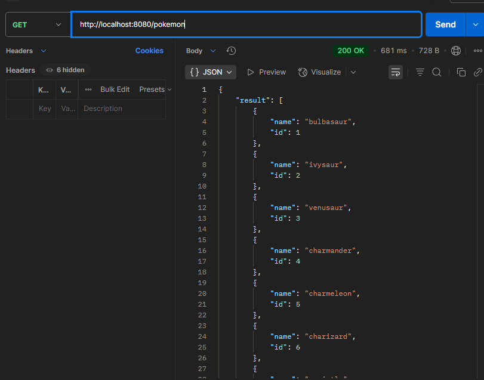
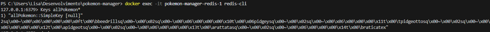
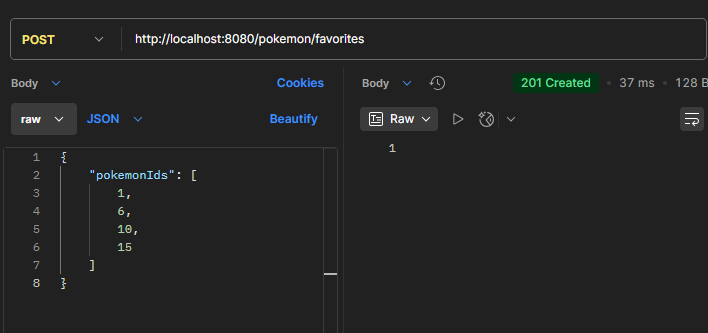
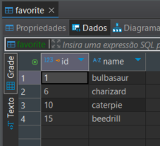
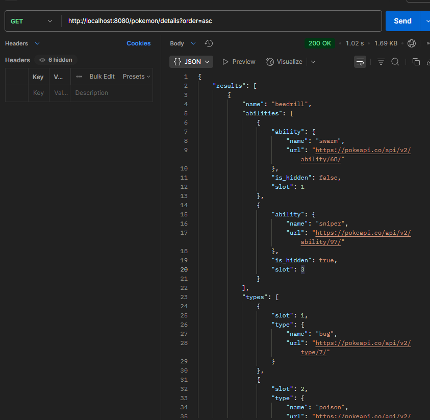
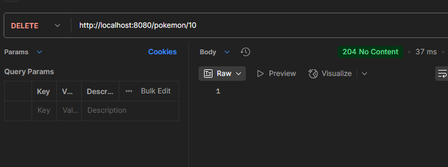
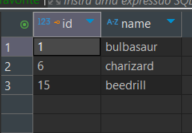
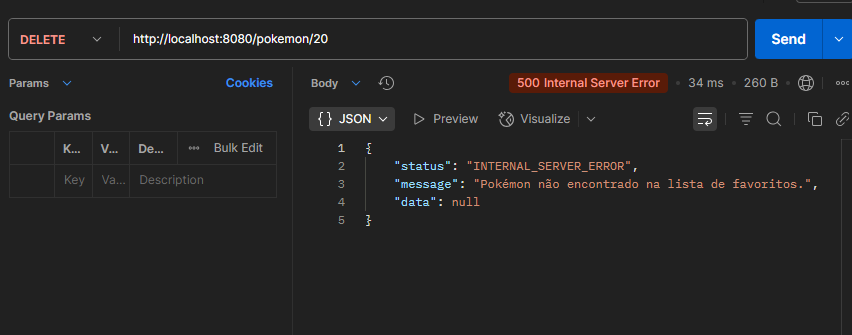

# pokemon-manager

## Visão Geral

Este projeto é uma API RESTful para gerenciar informações sobre Pokémon favoritos. Ele permite aos usuários listar todos os Pokémon (com opção de ordenação), adicionar Pokémon aos seus favoritos, listar os detalhes dos Pokémon favoritos (com opção de ordenação) e remover um Pokémon dos favoritos.

## Dados para Execução

Para executar esta aplicação localmente, siga os seguintes passos:

1.  **Pré-requisitos:**
    * Java Development Kit (JDK) 17 ou superior instalado.
    * Maven instalado (para gerenciamento de dependências e build).
    * Docker instalado (opcional, para executar o Redis facilmente).

2.  **Configuração do Banco de Dados:**
    * Por padrão, o Spring Boot pode configurar um banco de dados em memória H2. Se você deseja usar um banco de dados PostgreSQL (recomendado), você precisará:
        * Ter uma instância do PostgreSQL rodando.
        * Configurar as propriedades de conexão no arquivo `src/main/resources/application.properties`. Exemplo:

            ```properties
            spring.datasource.url=jdbc:postgresql://localhost:5432/pokemon
            spring.datasource.username=seu_usuario
            spring.datasource.password=sua_senha
            spring.jpa.properties.hibernate.dialect=org.hibernate.dialect.PostgreSQLDialect
            spring.jpa.hibernate.ddl-auto=update
            ```

3.  **Configuração do Redis:**
    * Se você não tiver o Redis instalado localmente, pode usar o Docker para executá-lo:

        ```bash
        docker run -d -p 6379:6379 redis
        ```
    * As configurações de conexão para o Redis podem ser definidas em `application.properties`:

        ```properties
        spring.redis.host=localhost
        spring.redis.port=6379
        ```

4.  **Build da Aplicação:**
    * Navegue até o diretório raiz do projeto no seu terminal.
    * Execute o comando Maven para build:

        ```bash
        mvn clean install
        ```

5.  **Execução da Aplicação:**
    * Após o build bem-sucedido, você pode executar a aplicação de duas maneiras:
        * **Usando o Maven:**

            ```bash
            mvn spring-boot:run
            ```
        * **Executando o JAR:** Encontre o arquivo JAR gerado em `target/pokemon-manager-*.jar` e execute:

            ```bash
            java -jar target/pokemon-manager-*.jar
            ```

6.  **Acesso à API:**
    * A API estará disponível por padrão em `http://localhost:8080`. Você pode usar ferramentas como `curl`, Postman ou Insomnia para interagir com os endpoints.


## Bibliotecas Utilizadas para o Desenvolvimento

As seguintes bibliotecas foram utilizadas no desenvolvimento deste projeto:

### Core Spring Framework

* **`org.springframework.boot:spring-boot-starter-web`**: Para construir aplicações web RESTful usando Spring MVC.
* **`org.springframework.boot:spring-boot-starter-data-jpa`**: Para persistência de dados usando JPA e Spring Data JPA (interação com o banco de dados).
* **`org.springframework.boot:spring-boot-starter-data-redis`**: Para integração com o Redis como um sistema de cache.
* **`org.springframework.boot:spring-boot-starter-cache`**: Para abstração de caching do Spring, utilizando o Redis como backend.
* **`org.springframework.boot:spring-boot-starter-aop`**: Para programação orientada a aspectos (pode ser usado para logging, etc.).
* **`org.springframework.boot:spring-boot-starter-validation`**: Para validação de dados usando as anotações do Bean Validation API.
* **`org.springframework.boot:spring-boot-starter-actuator`**: Para monitoramento e gerenciamento da aplicação (health checks, métricas, etc.).
* **`org.springframework.boot:spring-boot-starter-test`**: Para testes unitários e de integração com Spring Test e JUnit.

### Persistência de Dados

* **`org.postgresql:postgresql`**: Driver JDBC para o banco de dados PostgreSQL (dependência opcional, pode ser usado em vez do H2).
* **`com.h2database:h2`**: Banco de dados em memória H2 (usado por padrão para desenvolvimento).

### Cliente HTTP

* **`org.springframework.boot:spring-boot-starter-webflux`**: Para construir aplicações web reativas e clientes HTTP não bloqueantes.

### Outras Bibliotecas

* **`org.projectlombok:lombok`**: Para geração automática de código boilerplate (getters, setters, construtores, etc.) usando anotações.

### Testes

* **`org.junit.jupiter:junit-jupiter-api`**: Framework de testes JUnit 5.
* **`org.mockito:mockito-core`**: Framework de mocking para testes unitários.
* **`org.mockito:mockito-junit-jupiter`**: Integração do Mockito com JUnit 5.
* **`org.springframework:spring-test`**: Suporte para testes de integração do Spring.
* **`org.springframework.boot:spring-boot-test`**: Utilitários de teste específicos para Spring Boot.
* **`org.assertj:assertj-core`**: Biblioteca de assertions fluent para testes.
* **`com.jayway.jsonpath:json-path`**: Para trabalhar com JSON em testes.

## Evidencias de requisição Local

Requisição Listagem de Pokemon:



Requisição Adição de Favoritos:



Requisição Detalhes de Pokemon Favoritos:


Requisição Exclusão de Favorito:



Exceções Tratadas:
